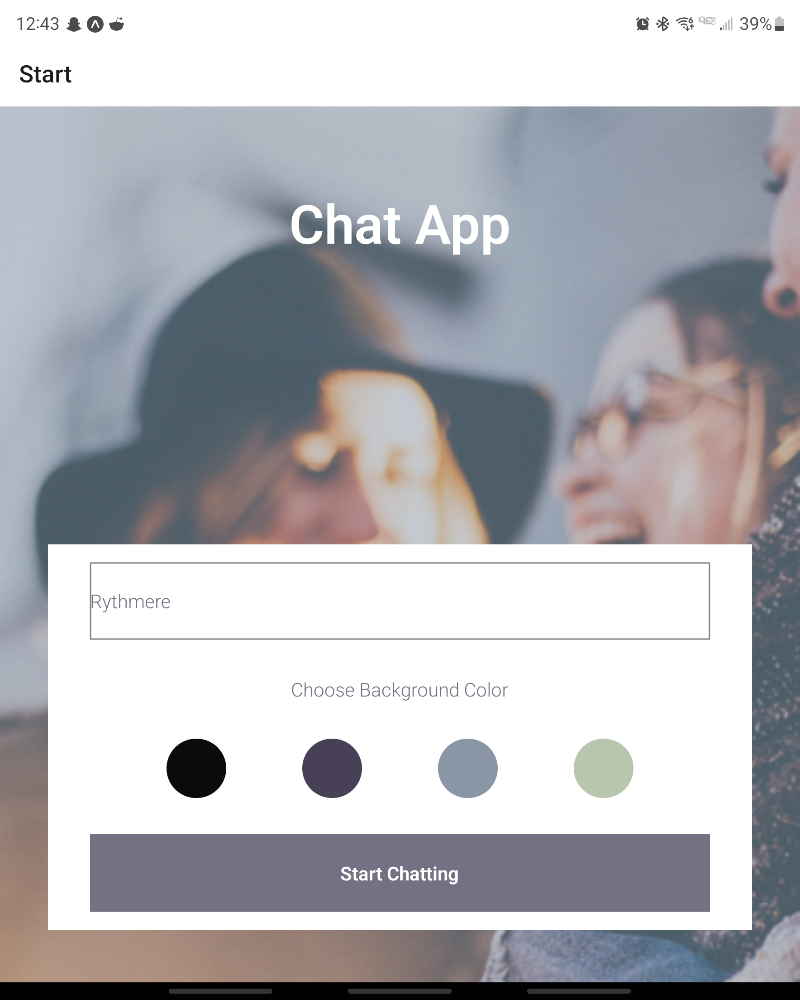

# Chat App
Chat app is a chatting application for mobile devices, created in React Native. The app provides users with a chat interface created with gifted chat and options to share images and their location while saving their messages to firestore and locally.

## tools: 
- Expo, 
- Google Firebase, Firestore Database, 
- React Native

## User Stories
- As a new user, I want to be able to easily enter a chat room so I can quickly start talking to my
friends and family.
- As a user, I want to be able to send messages to my friends and family members to exchange
the latest news.
- As a user, I want to send images to my friends to show them what I’m currently doing.
- As a user, I want to share my location with my friends to show them where I am.
- As a user, I want to be able to read my messages offline so I can reread conversations at any
time.

### Key Features
- A Start page where users can enter their name and choose a background color for the chat screen

- A page displaying the conversation, as well as an input field and submit button.
 
- Permission to send images and location data

- Offline storage 

- Anoynymous user authentication (via Google Firebase authentication)

## Prerequisities
- Node and latest version of npm
- Android studio, Xcode, or a mobile phone
- Expo 

## Setting up the development environment 
### Expo
1) Make sure expo-cli is installed globally
>npm install expo-cli --global
2) Fork or download project files

### Launch via emulator (Android Studio (Windows) or XCode (iOS)), or a mobile phone
2) Launch
>npm start
or 
>expo start
Then follow the instructions expo provides. The expo go mobile app will be required

## Database configuration
Chat-app makes use of Cloud Firestore, a real-time database which synchronizes data across multiple devices and stores it in Firebase's Cloud. 
>npm install --save firebase@7.24.0
(version used: "^7.24.0") planning to upgrade to firebase 9

## Necessary libraries to install.
1) React navigation and dependencies
>npm install --save react-navigation
>npm install @react-navigation/native @react-navigation/stack
>expo install react-native-reanimated react-native-gesture-handler react-native-screens react-native-safe-area-context @react-native-community/masked-view

2) Gifted Chat library
>npm install react-native-gifted-chat --save

3) React-Native async storage
>expo install @react-native-async-storage/async-storage

4) NetInfo package
>npm install --save @react-native-community/netinfo

5) Expo's ImagePicker API 
>expo install expo-image-picker

6) Expo's Location API and react-native-maps
>expo install expo-location
>expo install react-native-maps